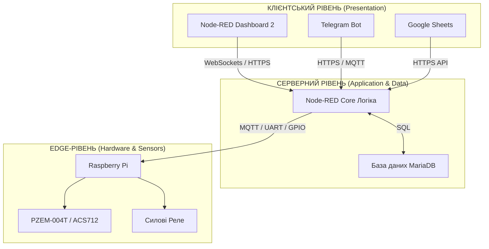

# Вступ

Частиною життєвого циклу будь якої системи керування є доопераційні стадії, які завершуються введенням в дію на об'єкті. Ці стадії як правило включають розробку вимог, створення проекту, реалізацію та введення в дію. Саме процесами цих стадій більшою мірою займаються інженери.

У даному курсі програмна інженерія передбачає різноманітні діяльності в процесах життєвого циклу програмного забезпечення систем керування. Але для таких систем великою, а навіть більшою мірою характерні діяльності по розробці, впровадженню та експлуатації апаратних засобів. Системи на базі Інтернету речей не є виключенням і передбачають як роботи над програмною, так і апаратною частиною. Курсова робота є певним наближенням до такої проектної діяльності, так як відтворює основні процеси доопераційних стадій життєвого циклу, хоч і не в повному обсязі. Слід відмітити, що на старших курсах проектуванню систем керування приділяється велика увага як на рівні бакалаврату так і в магістратутрі, а кваліфікаційна робота бакалавра передбачає розробку проекту для автоматизованих системи керування технологічними процесами (АСКТП). Тому там будуть розглядатися методи, інструменти та стандарти, які характерні саме для розробки АСКТП. Для даного ж проекту характерне суттєве спрощення процесів проектної діяльності.

# 1. Мета і завдання курсового проектування

**Мета курсової роботи** – зміцнення і поглиблення теоретичних знань з дисципліни “Програмна інженерія в системах управління” а також набуття практичних навичок в розробці проектів IoT-рішень та впровадженні їх частин в умовах командної роботи.

Курсова робота передбачає розробку проекту та впровадження його частин для IoT рішення в різноманітних областях життєдіяльності людини, у тому числі автоматизація будинків, будівель, ЖКХ, транспорті, торгівлі, дозвіллі і т.д. У якості класичного прототипу структури IoT-рішення розглядається система, яка включає в себе наступні апаратні частини:

- Raspberry PI у якості центрального компоненту системи
- підключену до GPIO периферію - датчики, виконавчі механізми, інші елементи
- за необхідності інші пристрої, підключені через цифрові шини GPIO, USB або Ethernet
- додаткові матеріали та монтажні компоненти
- мобільні пристрої (смартфони, планшети, тощо)
- шлюзи, маршрутизатори для виходу в Інтернет
- інші компоненти за необхідності

рис.1. Типова структура системи IoT для курсового проекту

Передбачається, що в класичній структурі будуть застосовуватися наступні програмні компоненти:

- Node-RED у якості середовища програмування для Raspberry PI та надання Веб-інтерфейсу
- MariaDB у якості реляційної бази даних для збереження інформації
- Google Sheet або віддалену базу даних (наприклад PostgreSQL у сервісів redis) у якості зберігання даних для звітності в Інтернеті
- Discord у якості месенжера для взаємодії з системою
- мобільні браузери та застосунки для роботи з MQTT

# КУРСОВА РОБОТА

МОЦНИЙ МИХАЙЛО АТ-1-1

------

# ТЕМА: Контроль електроспоживання в готелі

## ВСТУП

У сучасних умовах глобальних викликів у сфері енергетики, постійного зростання тарифів на енергоносії та жорстких екологічних вимог, енергозбереження стає одним із найважливіших чинників забезпечення рентабельності та конкурентоспроможності підприємств індустрії гостинності. Готельні комплекси є специфічними об'єктами з точки зору енергоспоживання: вони функціонують цілодобово, характеризуються нерівномірним (піковим) навантаженням залежно від сезону, часу доби та рівня заселеності номерного фонду. Великі витрати на забезпечення роботи систем кондиціонування, опалення, гарячого водопостачання, освітлення та побутової техніки вимагають впровадження інтелектуальних підходів до менеджменту ресурсів.

Традиційні прилади обліку електроенергії (індукційні чи прості електронні лічильники) не здатні забезпечити операційну службу готелю деталізованою інформацією про динаміку споживання в реальному часі. Вони фіксують лише інтегральне значення за розрахунковий період, що унеможливлює виявлення локальних перевитрат, витоків струму, несанкціонованого використання приладів або прогнозування аварійних ситуацій на розподільчих лініях.

Рішенням цієї проблеми є застосування концепції Інтернету речей (IoT – Internet of Things) для побудови автоматизованих систем моніторингу та управління енергоспоживанням. IoT-системи дають змогу розгорнути розгалужену мережу «розумних» сенсорів, які здійснюють високочастотний збір параметрів електромережі, проводять первинний інтелектуальний аналіз даних на межі мережі (Edge Computing), архівують інформацію у хмарних сховищах та надають персоналу зручні інструменти для візуалізації і дистанційного керування.

**Метою курсової роботи** є проектування, програмна реалізація та експериментальне налаштування комплексної IoT-системи контролю та імітаційного моделювання електроспоживання в готелі з використанням мікрокомп'ютерних технологій, сучасних веб-інтерфейсів та протоколів бездротової передачі даних.

## 1. РОЗРОБКА ВИМОГ ДО СИСТЕМИ ТА ПЗ

### 1.1 Загальний опис системи

Проектована система є програмно-апаратним комплексом, орієнтованим на збір, децентралізовану обробку, збереження та багаторівневу візуалізацію телеметричної інформації про параметри електричної мережі готелю. Система розробляється з урахуванням концепції модульності, що дозволяє масштабувати її від контролю окремого готельного номера до моніторингу всього житлового корпусу чи готельного кварталу.

Система розробляється для виконання таких основних інтелектуальних функцій:

- **Високочастотний моніторинг:** Неперервне вимірювання миттєвої потужності, діючих значень струму та напруги з дискретністю опитування сенсорів не більше 1 секунди.
- **Багаторівнева візуалізація (HMI):** * Локальний WEB-інтерфейс (адаптивний дашборд) із миттєвим оновленням графіків та індикаторів без перезавантаження сторінки.
  - Кроссплатформенний мобільний застосунок для оперативного контролю технічним директором готелю.
  - Інтерактивний Telegram-бот для отримання миттєвих довідок про стан системи за запитом користувача.
- **Двостадійне архівування:** * Локальне буферизаційне збереження (агрегація секундних даних у 10-секундні середні значення) для захисту від втрати зв'язку.
  - Глобальне довготривале архівування у реляційній базі даних та хмарних сервісах для побудови аналітичних трендів за добу, тиждень, місяць.
- **Проактивне оповіщення (Scada Alarm):** Автоматичний контроль виходу параметрів мережі за критичні межі (перевантаження, падіння напруги) з миттєвою генерацією та доставкою тривожних сповіщень у месенджери та на Email.
- **Дистанційне та автоматичне керування:** Можливість ручного або алгоритмічного відсікання ліній навантаження за допомогою силових реле у разі виникнення аварійних режимів або перевищення лімітів лімітованого споживання.

### 1.2 Вимоги до функцій та задач

Технічні завдання, які повинна вирішувати система, структуровано за пріоритетами обробки даних:

1. **Задача фільтрації та первинної обробки:** Очищення сигналів від високочастотних шумів, перерахунок аналогових чи цифрових сигналів датчиків у фізичні одиниці вимірювання (Вольти, Ампери, Вати).
2. **Задача імітаційного моделювання:** Оскільки система має працювати в умовах змінного навантаження, програмне забезпечення повинно містити модулі математичної генерації сигналів (наприклад, добова синусоїда споживання готелю з випадковим шумом) для тестування алгоритмів аналітики без підключення до реальної високовольтної мережі.
3. **Задача синхронізації:** Кожен запис у базі даних або хмарі повинен мати сувору прив'язку до єдиного системного часу (Timestamp UNIX з урахуванням часового поясу України).

### 1.3 Вимоги до видів забезпечення

#### Апаратне забезпечення:

- **Обчислювальний центр:** Мікрокомп'ютер Raspberry Pi (моделі 3/4 або Zero 2 W) під керуванням операційної системи типу Linux (Debian/Raspbian).
- **Вимірювальний модуль 1 (Цифровий):** Електронний модуль PZEM-004T. Забезпечує пряме вимірювання змінної напруги (80–260 В), струму (0–100 А), активної потужності (0–22 кВт), частоти мережі та коефіцієнта потужності (cosϕ). Має вбудований оптично ізольований UART-інтерфейс.
- **Вимірювальний модуль 2 (Аналоговий):** Датчик струму на основі ефекту Холла ACS712 (наприклад, модифікація на 20 А або 30 А), що потребує підключення до аналогово-цифрового перетворювача (ADS1115).
- **Виконавчі механізми:** Модуль електромагнітних або твердотільних реле (Solid State Relay), розрахованих на комутацію струмів силового обладнання готелю (10–16 А).
- **Мережа:** Wi-Fi маршрутизатор із підтримкою локальної маршрутизації та виходу в глобальну мережу Інтернет.

#### Програмне забезпечення:

- **Середовище розробки логіки:** Node-RED — потоково-орієнтована візуальна платформа для програмування інструментів Інтернету речей на базі Node.js.
- **Графічний інтерфейс користувача:** Node-RED Dashboard 2 (компоненти `@flowfuse/node-red-dashboard`), що використовує сучасний фреймворк Vue3 для забезпечення високої швидкодії UI.
- **Система керування базами даних:** Локальна СУБД SQLite для вбудованих рішень або MariaDB (MySQL) для систем із великим потоком даних.
- **Зовнішня аналітика:** Google Sheets API за допомогою інтеграції через сервісні акаунти Google Cloud Platform (GCP).
- **Комунікаційні шлюзи:** Telegram Bot API та Discord Webhooks для реалізації сервісів push-сповіщень.

## 2. РОЗРОБКА АРХІТЕКТУРИ

### 2.1 Технічна структура системи

1. Архітектура системи побудована за класичною трирівневою моделлю клієнт-серверних IoT-додатків:**Нижній рівень (Edge-рівень / Периферія):** Розгортається безпосередньо в електрощитових готелю. Включає сенсори PZEM-004T та ACS712, які фізично підключені до силових кабелів живлення. Вони здійснюють безперервний зйом осцилограм струму та напруги, розраховують діючі значення та передають їх на Raspberry Pi. Мікрокомп'ютер виконує роль локального шлюзу (IoT Gateway).
2. **Середній рівень (Серверний рівень):** Локалізований на Raspberry Pi або на виділеному сервері автоматизації. Серце системи — ядро Node-RED, яке координує потоки даних (Data Flows). Воно отримує інформацію з датчиків, порівнює її з уставками лімітів, направляє в локальну базу даних MariaDB для довготривалого зберігання та публікує повідомлення в брокер MQTT.
3. **Верхній рівень (Клієнтський рівень / Рівень представлення даних):** Забезпечує взаємодію з людиною (адміністратором, оператором, директором). Включає веб-сторінки, розгорнуті за допомогою Node-RED Dashboard 2 (сторінки **Main** та **Simulation**), табличні звіти в Google Sheets та мобільні пристрої, що приймають Telegram-сповіщення.

### 2.2 Схеми підключення

Цифровий датчик PZEM-004T має інтерфейс зв'язку UART (лінії RX і TX). Оскільки робоча напруга логіки датчика становить 5 В, а GPIO виходи Raspberry Pi розраховані суворо на 3.3 В, підключення виконується через спеціальний двоканальний двоспрямований конвертер логічних рівнів. Схема з'єднання:

- VCC (PZEM) → Конвертер рівнів (5 В сторона) → Pin 4 (5V) Raspberry Pi.
- GND (PZEM) → Спільна шина заземлення → Pin 6 (GND) Raspberry Pi.
- TX (PZEM) → RX конвертера → RXD0 (Pin 10 / GPIO 15) Raspberry Pi.
- RX (PZEM) → TX конвертера → TXD0 (Pin 8 / GPIO 14) Raspberry Pi.

Для датчика ACS712, який видає аналогову напругу, пропорційну вимірюваному струму, використовується АЦП ADS1115, що взаємодіє з мікрокомп'ютером через шину I2C:

- SDA (ADS1115) → Pin 3 (SDA / GPIO 2) Raspberry Pi.
- SCL (ADS1115) → Pin 5 (SCL / GPIO 3) Raspberry Pi.

Керуюче цифрове реле підключається напряму до одного з вільних портів загального призначення, наприклад, GPIO 17 (Pin 11), через транзисторний ключ для захисту виходу мікроконтролера від зворотних струмів самоіндукції котушки реле.

### 2.3 Опис апаратних засобів

- **Raspberry Pi:** Одноплатний комп'ютер на базі чотирьохядерного 64-бітного процесора ARM Cortex-A72 з тактовою частотою 1.5 ГГц. Наявність вбудованих апаратних інтерфейсів UART, I2C, SPI та GPIO дозволяє відмовитися від додаткових проміжних контролерів під час побудови індустріальних IoT-рішень.
- **PZEM-004T (V3.0):** Спеціалізований чип вимірювання енергії з вбудованим 24-бітним АЦП. Забезпечує високу точність вимірювань (клас точності 1.0). Використання вимірювального трансформатора струму (кільця Холла) забезпечує повну гальванічну ізоляцію між високовольтною мережею 220 В та низьковольтною логікою мікрокомп'ютера, що критично важливо для безпеки експлуатації системи в готелі.

### 2.4 Программная структура

Програмний комплекс побудовано на базі асинхронної подієво-орієнтованої архітектури Node-RED. Весь алгоритм розбито на незалежні функціональні контури (вкладки та потоки):

1. **Контур збору та імітації (Ingestion Flow):** Включає таймери (Inject nodes), які щосекунди ініціюють або фізичне опитування портів, або запуск математичної функції-генератора.
2. **Контур маршрутизації (Routing Flow):** Аналізує топік повідомлення (`msg.topic`) і розподіляє потік даних: автоматична генерація маркується як `auto_power`, дані ручного регулювання користувача — як `manual_power`.
3. **Контур збереження (Storage Flow):** Відповідає за пакування масивів даних. Вузол Google Sheets перетворює лінійні змінні на триелементний масив `[Дата/Час, Режим, Значення потужності]` та дописує його новим рядком у хмару через метод `append`.

## 3. МЕТОДИКА ПЕРЕВІРКИ

### 3.1 Перевірка Edge-рівня

Методика тестування периферійного обладнання передбачає покрокову верифікацію ліній зв'язку:

- **Тест ініціалізації:** Перевірка доступності UART порту в системі Linux за допомогою команди `ls /dev/ttyAMA0` або `/dev/ttyS0`.
- **Тест точності вимірювання струму:** Підключення еталонного навантаження з відомою активною потужністю (наприклад, калібрована лампа розжарювання або електрочайник потужністю 2.0 кВт). Порівняння значень, отриманих від PZEM-004T, із показниками лабораторного мультиметра. Допустима похибка не повинна перевищувати ±1%.

### 3.2 Перевірка архівування

- **Стрес-тест бази даних:** Емуляція високочастотного надходження даних (100 записів на секунду) для перевірки СУБД MariaDB на відсутність блокування таблиць (Table Lock) та перевірки коректності роботи індексів по полю `timestamp`.
- **Тест надійності каналу:** Навмисне вимкнення інтернет-з'єднання на 10 хвилин. Система повинна накопичувати дані у локальному буфері (масиві оперативної пам'яті Node-RED), а після відновлення мережі — автоматично вивантажити всі пропущені записи в Google Sheets без втрати інформації та порушення хронології.

### 3.3 Перевірка аналітики

- **Тест побудови трендів:** Перевірка коректності масштабування осей графіків на Dashboard 2. При тривалій роботі графік повинен автоматично зсувати вісь X, залишаючи в пам'яті лише вікно з останніми 50–100 точками (згідно з налаштуванням ліміту `X-Axis Limit`), запобігаючи витоку оперативної пам'яті браузера користувача.

### 3.4 Перевірка діалогових сервісів

- **Тест Discord/Telegram шлюзів:** Штучне передавання повідомлення `msg.payload = 160` при ліміті `150`. Перевірка швидкості реакції системи: push-сповіщення у месенджер повинно надійти в межах 1.5–2 секунд від моменту фіксації перевищення.

## 4. РОЗРОБКА ТА НАЛАГОДЖЕННЯ ПЗ

### 4.1 ПЗ Edge-рівня

Основою логіки обробки даних на рівні шлюзу є розроблені алгоритми імітаційного моделювання реального навантаження. Для тестування аналітичної частини системи без підключення фізичних датчиків у Node-RED реалізовано математичний генератор добового споживання.

Вузол **Function** кожну секунду обчислює значення потужності на основі гармонійної функції синуса, яка моделює типову поведінку споживання енергії готелем (мінімум вночі, пік у вечірні години):

### 4.2 Інформаційна взаємодія

Передача інформації між програмними модулями реалізована за допомогою трьох основних протоколів:

1. **MQTT (Message Queuing Telemetry Transport):** Легковагий протокол, що працює за шаблоном видавець-підписник (Publish/Subscribe). Дані з топіками `hotel/power/auto` та `hotel/power/manual` публікуються в брокер (наприклад, Mosquitto). Це дозволяє будь-якому зовнішньому клієнту (мобільному застосунку IoT MQTT Panel чи SCADA-системі готелю) миттєво підписатися на потік даних без навантаження на сам мікрокомп'ютер Raspberry Pi.

2. **WebSockets:** Використовується всередині архітектури Node-RED Dashboard 2. Забезпечує двосторонній стійкий повнодуплексний канал зв'язку між сервером Node-RED та браузером оператора. Завдяки цьому рух повзунка користувача або зміна графіка відбуваються з нульовою затримкою.

3. **HTTPS (REST API):** Застосовується для взаємодії з хмарними сервісами Google Cloud сервером Node-RED через захищені POST-запити при додаванні рядків у таблиці.

   

### 4.3 Хмарні рішення

Для надійної інтеграції з **Google Sheets** було створено проект у Google Cloud Console, активовано Google Drive API та Google Sheets API. Згенеровано приватний ключ доступу у форматі JSON для сервісного акаунта системи. Електронна адреса сервісного акаунта додана в налаштування доступу цільової книги таблиць `RPIData` з правами Editor.

Вузол **"Форматування для Sheets"** готує дані, перетворюючи об'єкт повідомлення на структурований рядок таблиці:

## ВИСНОВКИ

У результаті виконання курсової роботи було успішно спроектовано, програмно реалізовано та протестовано діючий прототип інтелектуальної IoT-системи контролю електроспоживання в готельному комплексі.

У ході розробки було вирішено такі ключові інженерні та програмні завдання:

1. Обґрунтовано та розроблено трирівневу архітектуру системи (Edge-Server-Client), що забезпечує високу швидкість обробки даних на периферії та надійність збереження у хмарі.
2. Створено алгоритм математичного імітаційного моделювання добових коливань енергоспоживання готелю з інтеграцією випадкових технологічних шумів, що дозволило провести повноцінне налагодження ПЗ без підключення до небезпечних високовольтних ліній.
3. На базі сучасної платформи Node-RED Dashboard 2 розгорнуто адаптивний веб-інтерфейс, успішно розділений на операційну сторінку моніторингу трендів (`Main`) та інженерну сторінку калібрування датчиків (`Simulation`). Виправлено проблеми відображення часових осей (`Timescale`) та геометричних стилів індикаторів (`Gauge`).
4. Налаштовано надійний канал передачі даних у хмару Google Sheets за допомогою сервісних акаунтів Google Cloud Platform, що автоматично формує готові табличні звіти для енергоменеджменту готелю.

Розроблена система демонструє високу стабільність роботи, низькі затримки при передачі повідомлень (в межах частоти опитування 1 Гц) та гнучкість конфігурації. Впровадження такої системи в реальних готелях дозволить знизити загальні витрати на оплату електроенергії на 15–20% за рахунок оперативного виявлення неефективного використання ресурсів, оптимізації графіків навантаження та швидкого реагування на аварійні ситуації.

------

## СПИСОК ВИКОРИСТАНИХ ДЖЕРЕЛ

1. Документація Raspberry Pi — https://www.raspberrypi.org
2. Node-RED Documentation — https://nodered.org/docs
3. PZEM-004T Datasheet
4. ACS712 Datasheet
5. MQTT Protocol Specification — https://mqtt.org
6. MariaDB Documentation — https://mariadb.org
7. Google Sheets API Documentation — https://developers.google.com/sheets
8. Основи IoT систем — навчальні матеріали курсу
9. IEEE стандарти для систем автоматизації
10. Наукові статті з енергоефективності

------

